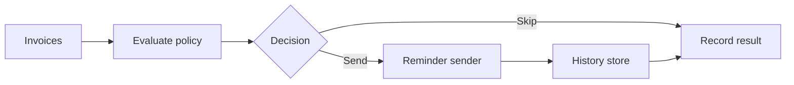

# Invoice Reminder Engine

[](https://github.com/warrantor-Antony-Stedfis/invoice-reminder-engine/actions/workflows/ci.yml)

A framework-independent TypeScript reference implementation for payment-aware invoice reminder workflows.

This is a reference implementation. It does not contain production code or customer data, and it does not send real email by default.

## What it demonstrates

- Money represented in minor units
- Payment-aware outstanding balance calculation
- Configurable reminder stages
- Explicit send and skip decisions
- Batch processing with summaries
- Deterministic idempotency keys
- Failure isolation between invoices
- Ports for delivery and reminder history
- Runnable in-memory adapters
- Strict TypeScript, automated tests and CI

## Workflow



## Core rules

- Only open invoices with an outstanding balance are eligible.
- Customer email and `remindersEnabled` are required.
- The latest reached reminder stage is selected.
- A selected stage is skipped if it was previously sent.
- Reminder dates use UTC calendar days.
- Duplicate invoice IDs and duplicate rule offsets are rejected.
- One failed invoice does not stop the remaining batch.

## Project structure

- `src/domain` — Financial models and pure reminder decisions.
- `src/application` — Batch planning and processing orchestration.
- `src/ports` — Contracts for reminder delivery and history.
- `src/adapters` — In-memory implementations of the ports.
- `tests` — Automated domain, application and adapter tests.
- `examples` — Runnable end-to-end demonstration.

## Run locally

Requires Node.js 22 or newer.

```bash
npm install
npm run check
npm run example
```

## Example

The example uses in-memory adapters. It does not send real email or connect to a database.

It runs the same batch twice to demonstrate reminder history and deterministic idempotency keys.

```bash
npm run example
```

Expected result:

- The first run sends one reminder.
- The second run skips it as already sent.
- No duplicate delivery is stored.

## Design boundaries

- No SMTP implementation.
- No database implementation.
- No scheduler.
- No distributed locking.
- No exactly-once guarantee.
- In-memory adapters are demonstration-only.

## Tests

The project has 65 automated tests. Node.js 22 and 24 are checked in GitHub Actions.

## Status

The reference implementation is complete and runnable.
